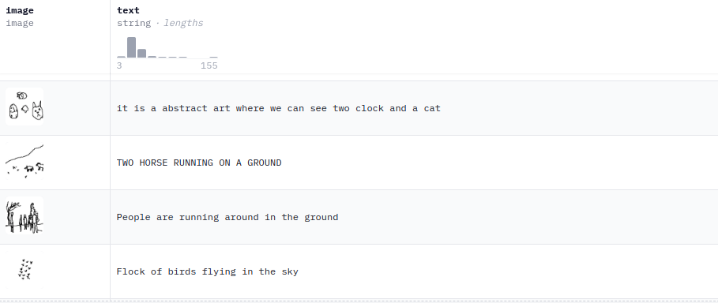
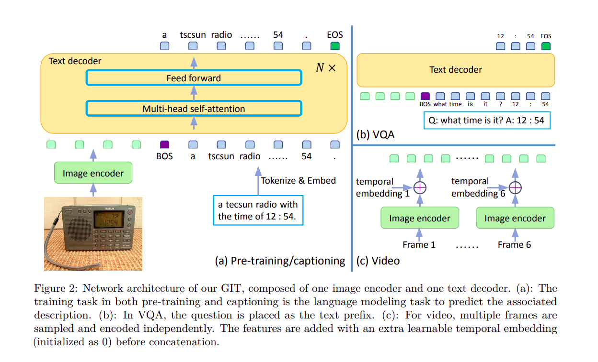
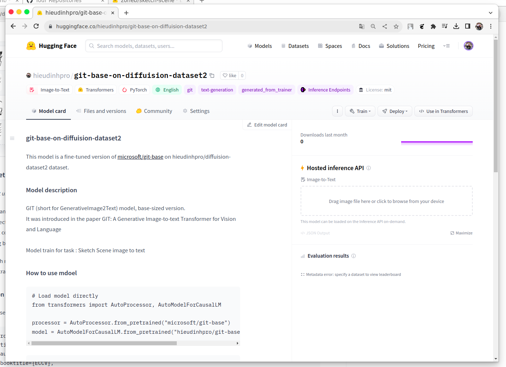

# Sketch Scene image to Text

## The dataset 
 \

 
Using "hieudinhpro/diffuision-dataset2" Hugging Face dataset \
Dataset copy from "zoheb/sketch-scene" \

## Overview the model 
GIT (short for GenerativeImage2Text) model, base-sized version. \
It was introduced in the paper GIT: A Generative Image-to-text Transformer for Vision and Language \


 \


## Fine turning model
This model is a fine-tuned version of microsoft/git-base on hieudinhpro/diffuision-dataset2 dataset. \


Model train for task :  image caption \

### Training hyperparameters

I dont have GPUs and alot of RAM so i train with mini batch =4  examples   \
The following hyperparameters were used during training:
- learning_rate: 2e-05
- train_batch_size: 4
- seed: 42
- gradient_accumulation_steps: 2
- optimizer: Adam with betas=(0.9,0.999) and epsilon=1e-08
- lr_scheduler_type: linear
- num_epochs: 1


### Framework versions

- Transformers 4.34.0
- Pytorch 2.0.1+cu118
- Datasets 2.14.5
- Tokenizers 0.14.0


## How to use mdoel from hugging face

Link : [hieudinhpro/git-base-on-diffuision-dataset2](https://huggingface.co/hieudinhpro/git-base-on-diffuision-dataset2)



```
# Load model directly
from transformers import AutoProcessor, AutoModelForCausalLM

processor = AutoProcessor.from_pretrained("microsoft/git-base")
model = AutoModelForCausalLM.from_pretrained("hieudinhpro/git-base-on-diffuision-dataset2")

```

```
# load image
from PIL import Image

image = Image.open('/content/image_3.jpg')
```
```
# pre image
inputs = processor(images=image, return_tensors="pt")
pixel_values = inputs.pixel_values

# predict 
generated_ids = model.generate(pixel_values=pixel_values, max_length=50)

# decode to text
generated_caption = processor.batch_decode(generated_ids, skip_special_tokens=True)[0]
print(generated_caption)
```


## Using Docker
> **Warning : run on laptop have minimun 8GB RAM and CPU >= i7**

```
docker pull hieudinhpro/sketch_scene_git_base:v1
```

```
docker run -p 8501:8501 hieudinhpro/sketch_scene_git_base:v1
```

 \
